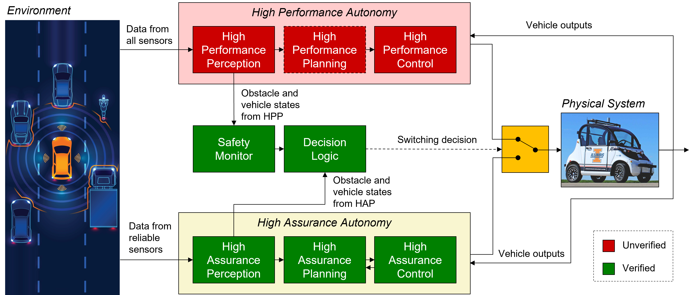
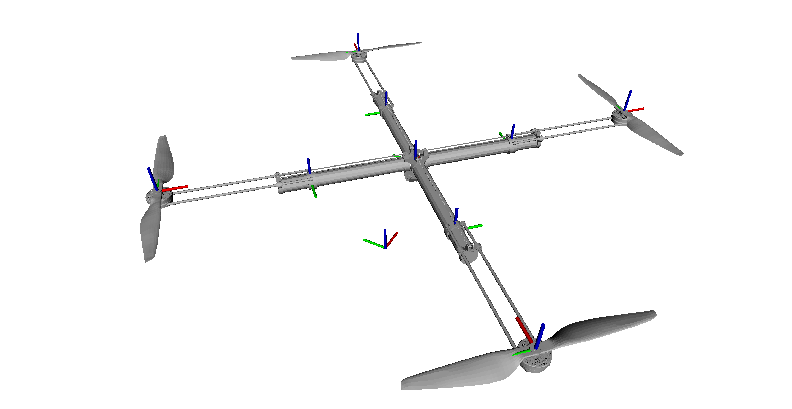

My research focuses on robotics and control, cyber-physical systems, and autonomous systems, particularly multi-scale aerial and ground vehicles.

## Research Projects

### Safe Learning-Enabled Control Systems 
A focal point of my upcoming research involves the integration of learning methodologies into control systems while ensuring robustness and safety. While machine learning (ML) heralds unprecedented levels of automation and autonomy, integrating it into safety-critical systems poses significant challenges. The opacity inherent in ML -- the difficulty in analyzing its decision-making processes -- presents hurdles in quantifying and mitigating uncertainties, especially when coupled with physical uncertainties. We addresses this challenge by proposing the Data-enabled Simplex (DeSimplex) solution, which facilitates a seamless transition of control authority from learning-based components to high-assurance solutions, maintaining safety thresholds and enabling continuous learning from operational environments to optimize performance and safety simultaneously. DeSimplex presents a pioneering approach that aims to harmonize learning mechanisms with safety assurances, promising advancements in autonomous system control. Its success hinges upon the seamless amalgamation of reliable perception, robust planning, (distributional) robust adaptive control, and intricate optimization techniques, coupled with comprehensive reachability analysis. 

||
|:--:| 
| *The DeSimplex architecture for autonomy pipeline* |

Beyond the DeSimplex framework, our interest extends to the realm of physics-informed neural networks and universal approximation theory. Understanding the intricate connections between fundamental physical laws and the functioning of deep neural networks holds immense promise. The exploration of how these theories can enrich and inform the design and operation of learning-based control systems presents an exciting avenue for future research.

### Resilient Cyber-Physical Systems
The co-existence of potential cyber attacks and physical damage poses a unique challenge in studying CPS security. On one hand, most cyber security approaches rely on model-based methodologies, requiring profiles of physical dynamics. Yet, changes in these dynamics due to damage, failures, or attacks render pre-stored profiles invalid, potentially compromising the efficacy of established security approaches. Simultaneously, while existing feedback control techniques adaptively compensate for physical damage, ensuring the integrity of control software remains critical.
The divergence in assumptions and models across cyber security and control research underscores the need for unified models built on coherent assumptions. Such models, supported by integrated technologies, form the cornerstone for defending against coordinated cyber and physical attacks more effectively. Leveraging diverse research areas, such as robust fault-tolerant control theory, fault diagnosis and prognosis (FDP), software assurance techniques, and real-time systems, enables us to forge a seamless integration that bolsters defense strategies. We are dedicated to furthering this research, drawing on our expertise and leveraging varied disciplines to develop robust defenses against cyber-physical threats.

### Urban Air Mobility (UAM)
UAM stands at the forefront of technological advancements, demanding intricately learning-based and/or adaptive control mechanisms to navigate the complexities of urban airspace. Its paramount importance is underscored by the imperative need for precise management of electric vertical takeoff and landing (eVTOL) aircraft within this domain. Research in this sphere revolves around the development of robust flight control systems that seamlessly transition between vertical and horizontal flight modes, optimizing crucial factors such as navigation, obstacle avoidance, and autonomous decision-making processes. The focus of this research is on the development and implementation of efficient control algorithms to ensure the safety, reliability, and energy efficiency of UAM vehicles. These control systems play a critical role in facilitating safe and efficient operations within dense and dynamically changing urban environments. As aerial transportation becomes increasingly integrated into urban settings, these control systems will become more and more crucial for the seamless and secure operation of UAM vehicles.

### Morphing Drones
Morphing drones represent a transformative leap in unmanned aerial vehicles (UAVs), offering unparalleled adaptability and versatility, and their significance from a control perspective is profound. The importance lies in their ability to dynamically alter their shape, configuration, or flight characteristics, enabling them to adapt to varying environmental conditions and mission requirements. 

||
|:--:| 
| *Over-the-shoulder view of the Telescoping Extension Arm  (TEA)-equipped quadrotor* |

Control systems in morphing drones are crucial as they must efficiently manage and coordinate the complex changes in the drone's morphology while ensuring stable flight and optimal performance. Research in this area focuses on designing, modeling, and control of morphing drones to enable enhanced agility, aerodynamic efficiency, and mission-specific functionalities, underscoring the critical role of control perspectives in harnessing the full potential of morphing drones across diverse applications, from search and rescue missions to environmental monitoring and beyond.
